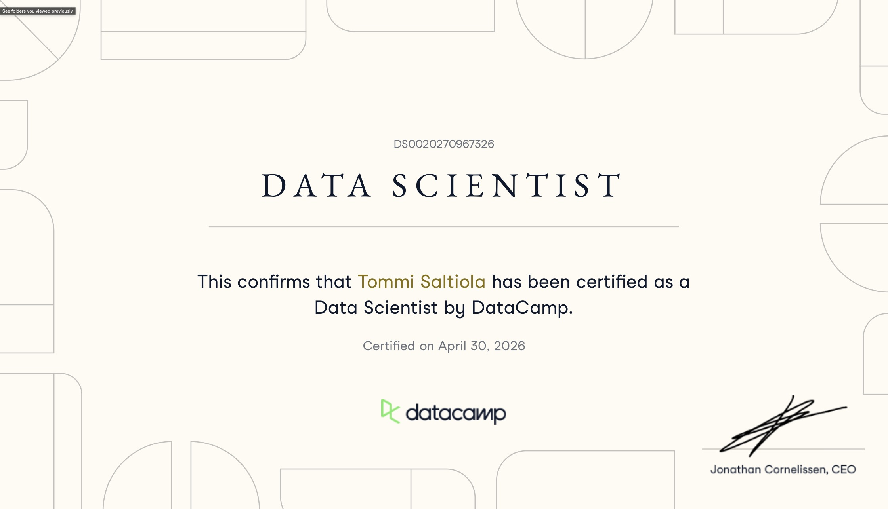
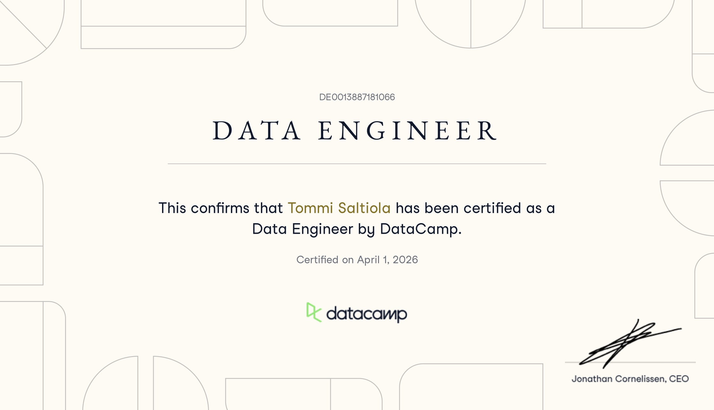

# Professional Certifications

This page records two professional credentials and links each one to a public,
runnable case study demonstrating related engineering work.

## DataCamp Data Scientist

| Evidence field | Reviewed value |
|---|---|
| Issuer | DataCamp |
| Credential | Data Scientist |
| Credential ID | `DS0020270967326` |
| Certification date | April 30, 2026 (`2026-04-30`) |
| Official verification | [Verify with DataCamp](https://careerhub-api.datacamp.com/certificates/DS0020270967326/pdf) |
| Public asset | `assets/certifications/datacamp-data-scientist.jpg` |
| SHA-256 | `41b1e4b20344bc75ff0debb054db594213707ca7a413272cd65316fac2c7a748` |
| Dimensions | 2241 × 1286 pixels |
| Visible-content review | Name, issuer, credential title, issue date, and verification ID are legible and appropriate for public professional use. A small captured macOS navigation tooltip is visible in the upper-left corner; it contains no client, assessment, credential-secret, or private-record content. |
| Metadata review | JPEG dimensions and color profile are present. Inspection found no embedded GPS location and no author, artist, or creator identity metadata. |

Broad competency mapping:

- data preparation, exploratory analysis, and statistical interpretation:
  [Synthetic Health Risk Quality Lab](projects/analytics-learning-labs/README.md#synthetic-health-risk-quality-lab),
  [Streaming Catalog Explorer](projects/analytics-learning-labs/README.md#streaming-catalog-explorer),
  and [Judo Medal Explorer](projects/analytics-learning-labs/README.md#judo-medal-explorer)
- predictive modeling, leakage control, evaluation, calibration, and slice
  analysis:
  [Content Performance Classifier](projects/content-performance-classifier/README.md)
- reproducible analytical communication:
  all five [Analytics Learning Labs](projects/analytics-learning-labs/README.md)
  expose declared grain, deterministic fixtures, metrics, limitations, and
  captioned evidence

Case study:

- [Data Scientist Certification Case Study](projects/content-performance-classifier/README.md)
- [Run in Molab](https://molab.marimo.io/github/Saltiola7/data-portfolio/blob/main/projects/content-performance-classifier/src/app.py/wasm)
- [Review source](projects/content-performance-classifier/src/content_performance_classifier/)
- [Review engineering specification](docs/specs/content_performance_classifier/README.md)

## DataCamp Data Engineer

| Evidence field | Reviewed value |
|---|---|
| Issuer | DataCamp |
| Credential | Data Engineer |
| Credential ID | `DE0013887181066` |
| Certification date | April 1, 2026 (`2026-04-01`) |
| Official verification | [Verify with DataCamp](https://careerhub-api.datacamp.com/certificates/DE0013887181066/pdf) |
| Public asset | `assets/certifications/datacamp-data-engineer.jpg` |
| SHA-256 | `a980ae6b80f08b294b57e6f5074f308544571ba4eaf68b7fff8fee500319f3ad` |
| Dimensions | 2238 × 1286 pixels |
| Visible-content review | Name, issuer, credential title, issue date, and verification ID are legible and appropriate for public professional use. No unrelated application, client, assessment, or private-record content is visible. |
| Metadata review | JPEG dimensions and color profile are present. Inspection found no embedded GPS location and no author, artist, or creator identity metadata. |

Broad competency mapping:

- ingestion, normalization, schema validation, grain control, and dead-letter
  handling:
  [Synthetic Wellness Data Pipeline](projects/wellness-data-pipeline/README.md)
- heterogeneous-source orchestration, incremental state, retries, watermarks,
  and transparent scoring:
  [Public-sector Opportunity Pipeline](projects/public-sector-opportunity-pipeline/README.md)
- data-quality contracts and explicit exception ledgers:
  [Airline Delay Quality Lab](projects/analytics-learning-labs/README.md#airline-delay-quality-lab)
  and
  [Restaurant Location Quality Lab](projects/analytics-learning-labs/README.md#restaurant-location-quality-lab)

Case study:

- [Data Engineer Certification Case Study](projects/wellness-data-pipeline/README.md)
- [Run in Molab](https://molab.marimo.io/github/Saltiola7/data-portfolio/blob/main/projects/wellness-data-pipeline/app.py/wasm)
- [Review source](projects/wellness-data-pipeline/wellness_data_pipeline/)
- [Review engineering specification](docs/specs/wellness_data_pipeline/README.md)

## Assessment boundary

Only the two owner-provided screenshots of issuer-issued credentials and their
public verification records are admitted. DataCamp assessment prompts,
datasets, solutions, schemas, metrics, outputs, grader rules, supplied code,
and private assessment history remain withheld. None is copied, transformed,
summarized at implementation detail, or required by a public app.

The linked case studies use public source, tests, documentation, and
deterministic synthetic fixtures. Competency mapping describes broad subject
alignment; it does not reproduce an assessment or claim that portfolio code is
an assessment submission.

## Review and replacement

The recorded SHA-256 values bind this page to the reviewed owner-provided JPEG
files. A replacement requires renewed visible-content and metadata review,
updated dimensions and checksum, and confirmation that its official
verification link remains valid. Credential images are evidence only and are
not licensed for reuse under the repository's MIT license.
