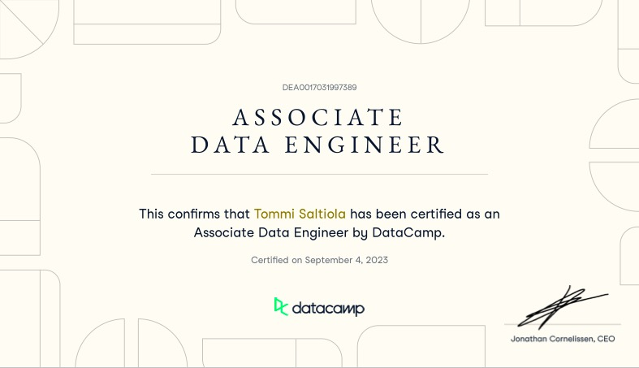
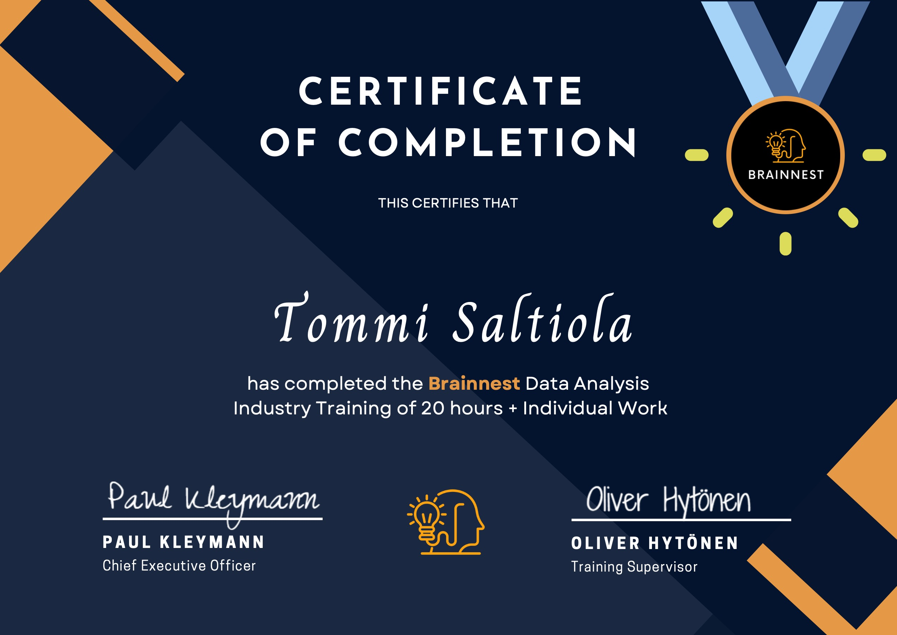
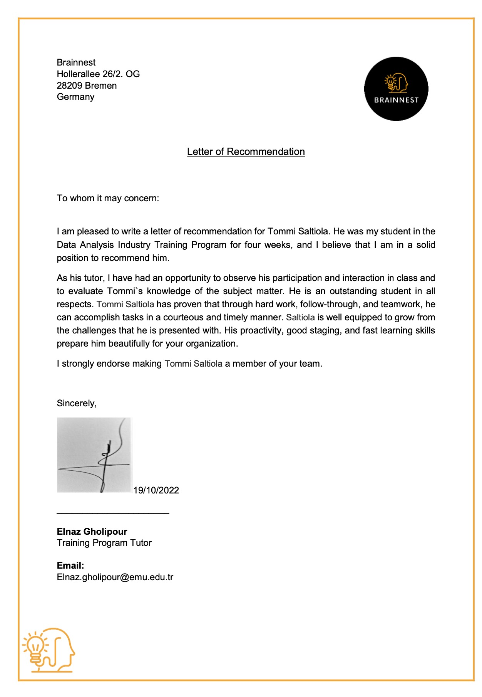

# Data Engineering & Analysis Portfolio

Welcome to my data analysis portfolio, which showcases my use of Python/Jupyter with numPy, matplotlib, pandas, seaborn, scipy and plotly as well as Tableau. Jupyter Notebooks analyze datasets for Airline, McDonalds, Cancer patients and Oura Smart Ring. Tableau projects include Wallmart Sales Analysis and Globally scientifically documented use cases for Cannabis. 

## Data Engineer certification from [Datacamp](https://www.datacamp.com/)

## Shopify API
- Querying the most popular products so we can display them in headless ecommerce with live data accordingly in the popular products section

## Airtable Scripts and Extensions
- Splitting data in one column into multiple columns with
- Built my own markdown to html extension so that we can write markdown into airtable and sync it as html to Webflow CMS

## Google Sheets for Lead Generation
- Script for checking the pagespeeds for URLs in column. Useful for lead generation. Also other smaller data cleaning scripts

## FDA Compliancy Script 
- Scrapes all pages of a website into a csv which can be imported to ChatGPT for analysis. We also give lates guidelines together with the CSV and prompt ChatGPT to point out any content that is against the guidelines. Saves time for creating compliant CBD content.

## Data Scraping
- Scraping job board data from multiple websites to custom job board application.

## Netflix & Brainnest folders have jupyter notebooks
- Data cleaning & fixing structural errors
- Check for outliers
- Descriptive Statistic
- Correlations
- Normality tests

### I answer questions like
- Why does higher % of gender 1 have malignant tumours?
- What other features may be linked to malignant tumours?
- What is Wallmarts most sold product?
- What are the most documented use cases for cannabis, where?

Take a look at each below or by navigating through the repository or my Tableau Public profile. Many of them are still a work in process. (These notebooks are made with Python 3.9.13)

- [Airline](https://github.com/Saltiola7/Data-Analysis-Portfolio/blob/main/Brainnest/airline.ipynb)
- [Cancer patient dataset](https://github.com/Saltiola7/Data-Analysis-Portfolio/blob/main/Brainnest/cancer-patient-dataset.ipynb)
- [McDonalds Dataset](https://github.com/Saltiola7/Data-Analysis-Portfolio/blob/main/Brainnest/mcdonalds.ipynb)
- [Globally scientifically documented use cases for Cannabis](https://public.tableau.com/views/UseofdifferentpartsofCannabisfordifferentmedicalusesindifferentcountries/Sheet8?:language=en-US&:display_count=n&:origin=viz_share_link)
- [Wallmart Sales Analysis](https://public.tableau.com/views/WallmartSalesAnalysis_16593931691930/Story1?:language=en-US&:display_count=n&:origin=viz_share_link)

## Certification and Recommendation Letter from [Brainnest](https://www.brainnest.consulting/)

## Oura folder is 