# Analytics Learning Labs

## Engineering Profile

| Field | Contract |
|---|---|
| Accountable owner | Tommi Saltiola |
| Public context | Supporting learning labs inside `Saltiola7/data-portfolio` |
| Private inputs | Historical Jupyter notebooks and DataCamp assessment work used only for admission review |
| Runtime | Python 3.12-3.14, Marimo 0.23.15, and pandas 3.0.5 |
| Package authority | Project `pyproject.toml` and `uv.lock` |
| Public data | Deterministic synthetic fixtures only |
| Browser delivery | GitHub-backed Molab `/wasm` links |
| Accessibility | WCAG 2.2 AA |
| Validation | pytest, Ruff, strict Marimo, executed WASM, Chromium, provenance, privacy, and claim review |
| Security and recovery owner | Repository owner |

Applicable DBSCTR modules: Python, Security, Data, Analytics, and Web.

## Domain

| Term | Meaning |
|---|---|
| learning lab | Small, runnable analytical demonstration below flagship status |
| private source | Historical notebook or assessment artifact that never enters public history |
| conversion diagnostic | Temporary Marimo conversion used only to discover migration failures |
| clean-room modernization | Independently written app, fixture, tests, prose, and conclusions sharing only a general analytical theme |
| certification evidence map | High-level mapping from certified competencies to independently implemented public successors |
| public credential image | Owner-approved issuer certificate carrying public professional identity and verification ID |
| synthetic fixture | Deterministic fictional data with no person, client, employer, course, or licensed-dataset record |
| evidence gate | Automated or reviewed proof that source, execution, claims, provenance, privacy, and browser behavior pass |

Entities:

- `LearningLab`, identified by slug and Marimo source path
- `SyntheticFixture`, identified by generator version and seed
- `AnalysisResult`, identified by lab, fixture identity, and analysis version
- `SourceLineage`, identified by private source name and public successor
- `MolabRuntime`, identified by repository commit and app path
- `PublicCredential`, identified by issuer, credential ID, image hash, and official verification URL

Private sources remain evidence for admission decisions, not public dependencies
or public authorship claims. Public code begins at the clean-room modernization
boundary.

## Visual Evidence

```mermaid
flowchart LR
    accTitle: Private-source review and clean-room learning-lab delivery
    accDescr: Private notebooks and assessment files enter a local admission audit only. General analytical themes cross a clean-room boundary into newly written synthetic fixtures, code, tests, and prose. Validated GitHub source is then available through on-demand Molab runtimes.

    PRIVATE["Private historical notebooks and assessment files"]
    AUDIT["Local admission and runtime audit"]
    THEME["General analytical theme or certified competency"]
    BOUNDARY{{"Clean-room boundary"}}
    FIXTURE["New deterministic synthetic fixture"]
    SOURCE["New Marimo app, analysis code, tests, and prose"]
    GATES["Privacy, provenance, execution, WASM, and browser gates"]
    GITHUB["Canonical GitHub source"]
    MOLAB["On-demand Molab /wasm runtime"]

    PRIVATE --> AUDIT
    AUDIT --> THEME
    THEME --> BOUNDARY
    BOUNDARY --> FIXTURE
    BOUNDARY --> SOURCE
    FIXTURE --> GATES
    SOURCE --> GATES
    GATES --> GITHUB
    GITHUB --> MOLAB
```

| Concern | Decision |
|---|---|
| Boundary | required: private-source and public clean-room boundary above |
| Interaction | not applicable: labs execute synchronously from deterministic local fixtures |
| State | not applicable: labs expose no durable workflow state |
| Data/trust | required: private inputs never cross into public source or runtime |
| Schema | required: each fixture grain and schema will be defined in this specification |
| Dependency/deployment | required: GitHub source is canonical and Molab derives its runtime |
| Quantitative | not applicable: admission does not depend on a numeric comparison |

**Review question:** Can every requested historical theme become a useful public
Marimo lab without publishing third-party prompts, unlicensed data, private
records, broken converted code, or unsupported conclusions?

**Text equivalent:** Private historical notebooks and certification files are
read only during a local audit. Only a general theme or competency may cross the
clean-room boundary. Every public lab receives newly written code, synthetic
fixtures, tests, prose, and conclusions. Privacy, provenance, execution, WASM,
and browser gates must pass before canonical GitHub source gains a Molab link.

Canonical source: this specification. Owner: repository owner. Change trigger:
source-admission, fixture, schema, app, validation, or delivery boundaries
change.
