# Analytics Learning Labs

## Engineering Profile

| Field | Contract |
|---|---|
| Accountable owner | Tommi Saltiola |
| Public context | Supporting learning labs inside `Saltiola7/data-portfolio` |
| Private inputs | Historical Jupyter notebooks and DataCamp assessment work used only for admission review |
| Runtime | Python 3.12-3.14, Marimo 0.23.15, and Pyodide-compatible pandas 3.0.2 |
| Package authority | Project `pyproject.toml` and `uv.lock` |
| Public data | Deterministic synthetic fixtures only |
| Browser delivery | GitHub-backed Molab `/wasm` links |
| Accessibility | WCAG 2.2 AA target; automated semantic and 390px reflow gates plus manual review |
| Validation | pytest, Ruff, strict Marimo, executed WASM, Chromium, provenance, privacy, and claim review |
| Security and recovery owner | Repository owner |

Applicable DBSCTR modules: Python, Security, Data, Analytics, and Web.

## Domain

| Term | Meaning |
|---|---|
| learning lab | Small, runnable analytical demonstration below flagship status |
| private source | Historical notebook or assessment artifact that never enters public history |
| conversion diagnostic | Temporary Marimo conversion used only to discover migration failures |
| clean-room modernization | Independently written app, fixture, tests, prose, and conclusions sharing only a general analytical theme |
| certification evidence map | High-level mapping from certified competencies to independently implemented public successors |
| public credential image | Owner-approved issuer certificate carrying public professional identity and verification ID |
| synthetic fixture | Deterministic fictional data with no person, client, employer, course, or licensed-dataset record |
| evidence gate | Automated or reviewed proof that source, execution, claims, provenance, privacy, and browser behavior pass |

Entities:

- `LearningLab`, identified by slug and Marimo source path
- `SyntheticFixture`, identified by generator version and seed
- `AnalysisResult`, identified by lab, fixture identity, and analysis version
- `SourceLineage`, identified by private source name and public successor
- `MolabRuntime`, identified by repository commit and app path
- `PublicCredential`, identified by issuer, credential ID, image hash, and official verification URL

Private sources remain evidence for admission decisions, not public dependencies
or public authorship claims. Public code begins at the clean-room modernization
boundary.

## Visual Evidence

```mermaid
flowchart LR
    accTitle: Private-source review and clean-room learning-lab delivery
    accDescr: Private notebooks and assessment files enter a local admission audit only. General analytical themes cross a clean-room boundary into newly written synthetic fixtures, code, tests, and prose. Validated GitHub source is then available through on-demand Molab runtimes.

    PRIVATE["Private historical notebooks and assessment files"]
    AUDIT["Local admission and runtime audit"]
    THEME["General analytical theme or certified competency"]
    BOUNDARY{{"Clean-room boundary"}}
    FIXTURE["New deterministic synthetic fixture"]
    SOURCE["New Marimo app, analysis code, tests, and prose"]
    GATES["Privacy, provenance, execution, WASM, and browser gates"]
    GITHUB["Canonical GitHub source"]
    MOLAB["On-demand Molab /wasm runtime"]

    PRIVATE --> AUDIT
    AUDIT --> THEME
    THEME --> BOUNDARY
    BOUNDARY --> FIXTURE
    BOUNDARY --> SOURCE
    FIXTURE --> GATES
    SOURCE --> GATES
    GATES --> GITHUB
    GITHUB --> MOLAB
```



| Concern | Decision |
|---|---|
| Boundary | required: private-source and public clean-room boundary above |
| Interaction | not applicable: labs execute synchronously from deterministic local fixtures |
| State | not applicable: labs expose no durable workflow state |
| Data/trust | required: private inputs never cross into public source or runtime |
| Schema | required: fixture schema and grain table in Specification |
| Dependency/deployment | required: GitHub source is canonical and Molab derives its runtime |
| Quantitative | not applicable: admission does not depend on a numeric comparison |

**Review question:** Can every requested historical theme become a useful public
Marimo lab without publishing third-party prompts, unlicensed data, private
records, broken converted code, or unsupported conclusions?

**Text equivalent:** Private historical notebooks and certification files are
read only during a local audit. Only a general theme or competency may cross the
clean-room boundary. Every public lab receives newly written code, synthetic
fixtures, tests, prose, and conclusions. Privacy, provenance, execution, WASM,
and browser gates must pass before canonical GitHub source gains a Molab link.

Canonical source: this specification. Owner: repository owner. Change trigger:
source-admission, fixture, schema, app, validation, or delivery boundaries
change.

## Behavior

### Replace a broken conversion with a clean-room modernization

Given an automatic Jupyter-to-Marimo conversion contains third-party prose,
unknown-license data, runtime errors, invalid observation grain, or unsupported
claims, when the historical theme is admitted, then no converter output enters
public history and an independently written synthetic lab replaces it.

### Run every lab from a deterministic default

Given a visitor opens any learning-lab Molab runtime without credentials,
uploads, or private infrastructure, when the app starts, then a deterministic
synthetic fixture produces a useful analysis, visible source identity, and no
failed cell.

### React without retaining visitor state

Given a visitor changes a supported seed control, when Marimo recomputes, then
the fixture and analysis update in memory, tables remain accessible, and no
owner backend receives or retains the input.

### Preserve analytical grain

Given a fixture contains repeated entities or events, when an analysis
summarizes outcomes, then it declares and enforces its observation grain rather
than weighting repeated aggregates as independent evidence.

### Reject unsafe health claims

Given the synthetic health-risk lab computes an association, when the result is
shown, then the app identifies the data as fictional, avoids diagnosis and
causal language, and explains that the result has no clinical validity.

### Publish professional credentials without assessment disclosure

Given the owner explicitly approves an issuer certificate image, when visible
content, metadata, hash, public purpose, and official verification URL pass
review, then the image may appear in the credential evidence page while
assessment prompts, data, code, schemas, metrics, and outputs remain private.

### Fail closed on notebook errors

Given a learning lab has a parse error, failed cell, missing local package,
private dependency, browser console error, or broken reactive control, when
quality gates run, then the lab and its Molab link are not admitted.

### Reject incomplete analytical dimensions

Given a fixture has a null or blank analytical grouping value, a non-numeric
measure dtype, or a nullable boolean value, when validation runs, then the
fixture fails before aggregation can silently drop the record or change a
denominator.

### Expose restaurant exceptions on the default path

Given the default restaurant fixture includes bounded missing-coordinate
examples, when the app runs, then valid rows appear in the accepted table,
missing-coordinate rows appear in the unresolved ledger, and both tables
together account for every source record.

### Keep the health demonstration non-circular

Given fictional risk bands and ordinal scores are generated, when the health
lab computes an association, then the risk band is not mechanically reconstructed
from the same score composite and the result remains explicitly descriptive,
synthetic, non-clinical, and non-causal.

### Preserve host and browser dependency parity

Given the app executes through Pyodide in WASM, when its environment and export
are validated, then the project lock, every PEP 723 header, and live
post-recomputation browser identity agree on pandas 3.0.2.

### Preserve portfolio hierarchy

Given learning labs demonstrate earlier or narrower analytical work, when the
root README presents them, then they remain a supporting section below the
three current flagships and are not described as production systems.

## Specification

### Project tree

```text
projects/analytics-learning-labs/
├── .marimo.toml
├── README.md
├── PROVENANCE.md
├── pyproject.toml
├── uv.lock
├── apps/
│   ├── airline_delays.py
│   ├── synthetic_cohort.py
│   ├── restaurant_locations.py
│   ├── streaming_catalog.py
│   └── sports_outcomes.py
├── analytics_learning_labs/
│   ├── __init__.py
│   ├── analysis.py
│   ├── contracts.py
│   ├── fixtures.py
│   └── presentation.py
└── tests/
    ├── test_analysis.py
    ├── test_apps.py
    ├── test_contracts.py
    ├── test_fixtures.py
    ├── test_presentation.py
    └── test_provenance.py
```

The five apps share one locked package and dependency environment. No `.ipynb`,
converted notebook, historical dataset, or saved legacy output is committed.

### Application registry

| App | Historical theme only | Public source | Default grain | Primary result |
|---|---|---|---|---|
| Airline Delay Quality Lab | `airline.ipynb` | `apps/airline_delays.py` | one fictional flight | carrier delay-quality summary |
| Synthetic Health Risk Quality Lab | `cancer-patient-dataset.ipynb` | `apps/synthetic_cohort.py` | one unique fictional profile after duplicate audit | profile duplication and ordinal association summary |
| Restaurant Location Quality Lab | `mcdonalds.ipynb` | `apps/restaurant_locations.py` | one fictional location record | accepted locations plus unresolved ledger |
| Streaming Catalog Explorer | `notebook.ipynb` | `apps/streaming_catalog.py` | one fictional catalog title | duration summary by release period and genre |
| Judo Medal Explorer | `winning-medal-in-judo.ipynb` | `apps/sports_outcomes.py` | one fictional athlete-event | medal-rate summary at declared event grain |

### Shared interfaces

```python
@dataclass(frozen=True)
class FixtureContract:
    slug: str
    required_columns: tuple[str, ...]
    grain_columns: tuple[str, ...]
    maximum_rows: int

@dataclass(frozen=True)
class AnalysisResult:
    lab_slug: str
    grain: str
    metrics: Mapping[str, str | int | float]
    primary_table: pandas.DataFrame
    secondary_table: pandas.DataFrame | None
    notes: tuple[str, ...]

def validate_fixture(frame: pandas.DataFrame, contract: FixtureContract) -> None: ...
def generate_airline_fixture(seed: int, rows: int = 160) -> pandas.DataFrame: ...
def generate_cohort_fixture(seed: int, rows: int = 180) -> pandas.DataFrame: ...
def generate_restaurant_fixture(seed: int, rows: int = 140) -> pandas.DataFrame: ...
def generate_streaming_fixture(seed: int, rows: int = 180) -> pandas.DataFrame: ...
def generate_sports_fixture(seed: int, rows: int = 220) -> pandas.DataFrame: ...
def analyze_airline_delays(frame: pandas.DataFrame) -> AnalysisResult: ...
def analyze_synthetic_cohort(frame: pandas.DataFrame) -> AnalysisResult: ...
def analyze_restaurant_locations(frame: pandas.DataFrame) -> AnalysisResult: ...
def analyze_streaming_catalog(frame: pandas.DataFrame) -> AnalysisResult: ...
def analyze_sports_outcomes(frame: pandas.DataFrame) -> AnalysisResult: ...
```

Every generator accepts an integer seed and produces byte-stable tabular values
for the supported runtime. Every analysis validates its fixture before
computing results.

### Schema, grain, and boundaries

| Lab | Required columns | Canonical grain | Boundary rules |
|---|---|---|---|
| airline | `flight_id`, `carrier`, `route`, `arrival_delay_minutes`, `carrier_delay_minutes`, `late_aircraft_delay_minutes`, `cancelled` | unique `flight_id` | non-negative component delays; cancelled rows use zero delay placeholders excluded from completed-flight delay means; no person data |
| cohort | `record_id`, `profile_key`, `age_band`, `exposure_score`, `genetic_risk_score`, `obesity_score`, `risk_band` | unique `record_id`; analysis deduplicates agreeing repeats to `profile_key` | ordinal scores 0-10; repeated profile records must agree on all profile attributes; fictional risk bands generated independently of the analyzed score composite; no clinical inference |
| restaurant | `record_id`, `location_label`, `country`, `region`, `latitude`, `longitude` | unique `record_id` | resolved latitude -90..90 and longitude -180..180; bounded null coordinates are retained for the unresolved ledger |
| streaming | `title_id`, `release_year`, `duration_minutes`, `genre`, `content_type` | unique `title_id` | plausible year and positive duration; fictional titles only |
| sports | `event_id`, `athlete_id`, `team`, `continent`, `weight_class`, `medal` | unique `event_id` | no names; athlete team, continent, and weight class remain stable across repeated events; medal boolean; summaries preserve event grain |

Each generator records `generator_version`, `seed`, and a canonical CSV
`fixture_sha256` in app-visible evidence. No fixture is stored as a third-party
dataset.

### Marimo app interface

Every app:

1. carries PEP 723 dependencies for Marimo 0.23.15 and pandas 3.0.2,
   matching the project lock and resolved Pyodide browser package;
2. exposes exactly one level-one heading and one visible `label[for]`-associated
   integer seed control; Marimo 0.23.15's generated raw-markup `aria-label`
   remains a documented accessibility limitation;
3. runs a deterministic default fixture without external data, API, private
   service, or credentials after Molab/Pyodide runtime dependencies load;
4. displays fixture identity, grain, limitations, metrics, and a captioned table;
5. exposes success, validation, and unexpected-error semantics without color
   alone; Marimo supplies its native pending-cell indicator during recomputation;
6. recomputes visibly after a seed change;
7. performs no owner-side persistence, logging, or remote request.

### Credential evidence interface

`CERTIFICATIONS.md` owns the public credential and competency map.
`assets/certifications/` owns the two owner-approved issuer JPEG files.

For each credential, the page records:

- title, issuer, credential ID, certification date, and official verification
  URL;
- repository-relative image path, SHA-256, visible-content review, and metadata
  review;
- broad certified competency areas;
- links to independently implemented public successor projects;
- an explicit statement that assessment prompts, datasets, solutions, schemas,
  metrics, outputs, and grader rules remain private.

### Molab URL contract

The root README uses durable post-merge URLs:

```text
https://molab.marimo.io/github/Saltiola7/data-portfolio/blob/main/projects/analytics-learning-labs/apps/<app>.py/wasm
```

Pre-merge verification uses the pushed 40-character commit SHA because
slash-named feature branches are ambiguous in Molab routes. CI installs one
locked learning-lab environment, checks all five apps strictly, executes each
WASM export, validates the local package wheel and exact pandas 3.0.2 browser
resolution, and runs one Chromium journey per app.

### Ownership and dependency order

- LAB-002 owns only credential images and `CERTIFICATIONS.md`.
- LAB-003 through LAB-007 own disjoint app behavior plus shared package changes
  coordinated through LAB-001 contracts.
- LAB-008 owns root README, root validation tests, workflow, browser smoke,
  dependency inventory, provenance summaries, and lifecycle closure.
- App implementation starts only after LAB-001 behavior, interfaces, schemas,
  and contracts are committed.

## Contracts

### Fixture generation

1. Every generator accepts an integer `seed` and a positive integer `rows`.
2. Supported row counts are 20 through the contract's `maximum_rows`,
   inclusive. Values outside that range raise `ValueError` before allocation.
3. The same generator version, seed, and row count produce equal frames with
   the same row order and dtypes.
   Default-fixture SHA-256 snapshots are pinned; changing one requires an
   explicit generator-version and provenance review.
4. Generated identifiers are stable, lab-prefixed, and unique at the declared
   grain.
5. Fixtures use fictional labels and synthetic numeric values only. They
   contain no names, email addresses, account identifiers, employer records,
   assessment material, or copied third-party rows.
6. Generators perform no network, file-system, environment-variable,
   credential-store, analytics, or telemetry access.

### Validation and analysis

1. `validate_fixture` rejects missing required columns, empty frames, frames
   above `maximum_rows`, duplicate grain keys, null grain keys, null or blank
   analytical dimensions, nullable booleans, non-numeric measure dtypes, and
   values outside the lab-specific boundaries. Restaurant latitude and
   longitude are the deliberate null exception: bounded missing coordinates
   are admitted so analysis can classify each row into accepted or unresolved
   evidence.
2. Analyses call `validate_fixture` before aggregation and never silently
   discard invalid records.
3. Every `AnalysisResult.lab_slug` matches its contract, `grain` names the
   analysis grain, and metric values are finite JSON-compatible scalars.
4. Primary and secondary tables preserve the declared analytical denominator.
   Where deduplication is intentional, the result names both source-record and
   unique-profile counts.
5. Restaurant analysis produces an explicit accepted table and unresolved
   ledger, accounts for every source record exactly once, and never invents
   coordinates for an unresolved record. The deterministic default fixture
   exercises both paths.
6. Health-lab output is descriptive educational evidence only. It does not
   diagnose, predict an individual's outcome, estimate treatment effect, imply
   causality, or recommend medical action.
7. Fictional health risk bands are not derived deterministically from the exact
   score composite used by the association. Undefined associations fail closed
   instead of being converted to a numeric value.
8. Repeated cohort records may be deduplicated only when age band, all three
   scores, and risk band agree. A conflicting profile fails validation rather
   than being collapsed by row order.
9. Airline delay means use completed flights only. Cancelled rows use explicit
   zero placeholders that are excluded from those means while remaining in
   flight, cancellation, and operational on-time denominators.
10. A repeated fictional athlete retains one team, continent, and weight class;
   each fictional team maps to one continent.

### Marimo application behavior

1. Each source is a valid Marimo app under `marimo check --strict`.
2. The default app run completes without a failed cell, page error, console
   error, unhandled exception, private data/API dependency, or credential
   prompt after Molab/Pyodide runtime dependencies load.
3. Each app contains exactly one visible H1, one visible `Seed` label associated
   to a numeric control, a limitations statement, a fixture/grain statement,
   visible metrics, and at least one captioned table. WCAG 2.2 AA remains a
   target until Marimo's generated raw-markup `aria-label` exposes the plain
   accessible name.
4. Changing the seed causes visible fixture identity and result evidence to
   change without reloading the page.
5. Success, validation-error, and unexpected-error states are distinguishable
   in text; Marimo supplies its native pending-cell indicator during
   recomputation, and color is never the sole signal.
6. Apps retain no user input after the browser session and make no owner-side
   write, logging, or analytics request.

### Credential evidence

Only these owner-approved issuer credentials are admitted:

| Credential | Public asset | Required SHA-256 | Official verification |
|---|---|---|---|
| Data Scientist | `assets/certifications/datacamp-data-scientist.jpg` | `41b1e4b20344bc75ff0debb054db594213707ca7a413272cd65316fac2c7a748` | `https://careerhub-api.datacamp.com/certificates/DS0020270967326/pdf` |
| Data Engineer | `assets/certifications/datacamp-data-engineer.jpg` | `a980ae6b80f08b294b57e6f5074f308544571ba4eaf68b7fff8fee500319f3ad` | `https://careerhub-api.datacamp.com/certificates/DE0013887181066/pdf` |

Private gate evidence verifies the owner-provided source locally. The public
repository records only the admitted destination path, credential ID, issue
date, file hash, dimensions, metadata review, and visible-content review.
Admission fails if a copied asset's hash differs, its metadata contains GPS or
author identity, or the public page includes assessment prompts, solutions,
datasets, schemas, metrics, grader rules, or copied assessment output.
Credentials support broad competency claims only; they do not prove authorship
of the private assessment implementation.

### Packaging and dependency boundaries

1. The learning-lab project has one `pyproject.toml`, one `uv.lock`, and one
   local package named `analytics_learning_labs`.
2. Runtime dependencies are direct, version-constrained, and compatible with
   Pyodide. No application imports another portfolio project or private module.
3. Each executed WASM export contains exactly one wheel for the local package
   and imports it successfully in Chromium.
4. The root dependency inventory names every direct dependency, its purpose,
   license, lock source, and browser/WASM boundary.

### CI, Molab, and deployment-preview evidence

1. CI checks all five app paths explicitly or derives them from one committed
   registry; a partial loop is a failure.
2. CI runs unit tests, Ruff, strict Marimo checks, executed HTML-WASM export,
   local-wheel validation, and a Chromium journey for every app.
3. Durable README links use `blob/main`. Pre-merge Molab checks use the exact
   pushed 40-character commit SHA and do not mutate remote state.
4. Before push, executed local WASM plus Chromium is deployment-preview
   evidence, not proof of public Molab availability.
5. After push, public verification records the immutable commit URL and treats
   an unavailable or erroring Molab route as a failed Deploy gate.

### Provenance, migration, and rollback

The five legacy notebooks and six certification scripts are input evidence for
theme and competency discovery only. Their code, prose, datasets, outputs, and
history are not migrated. The public migration is a newly authored synthetic
implementation with a provenance ledger. Rollback is a Git revert of the
learning-lab and portfolio-integration commits; no user data migration or
remote service rollback is required.

### Maintenance and retirement

The owner reviews locked dependencies and all Molab links at least quarterly
and when Marimo, Pyodide, pandas, or the package format changes materially. A
lab is retired when its default path no longer runs safely, its evidence cannot
be reproduced, or provenance becomes uncertain. Retirement removes the public
link first, preserves the reason in the changelog, and never replaces evidence
with an unsupported claim.

### Required verification

The implementation is admissible only when all of these commands pass:

```bash
uv sync --locked --project projects/analytics-learning-labs
(cd projects/analytics-learning-labs && uv run --frozen pytest)
(cd projects/analytics-learning-labs && uv run --frozen ruff check .)
(cd projects/analytics-learning-labs && uv run --frozen ruff format --check .)
(cd projects/analytics-learning-labs && uv run --frozen marimo check --strict apps/*.py)
uv run --frozen python scripts/validate_wasm_export.py <export-dir> --package analytics_learning_labs --dependency pandas==3.0.2
uv run --frozen python scripts/browser_smoke.py <preview-root> --scenario learning-labs --path <app-path>
uv run --frozen pytest -q tests/test_repository_only_portfolio.py
```

The repository may add command wrappers, but they must preserve these
observations and fail closed on skipped apps, failed cells, browser errors,
asset-hash drift, provenance drift, or private-source leakage.
