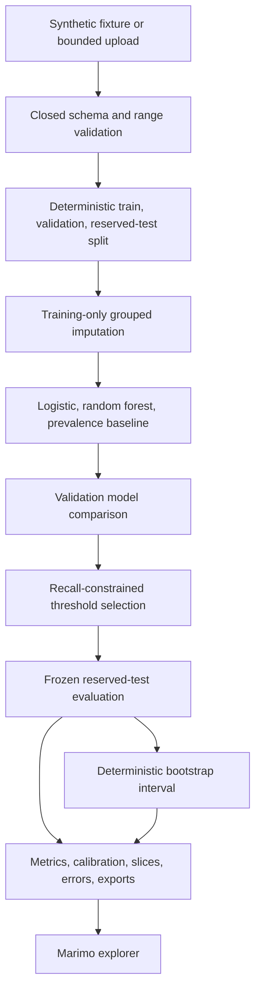

# Content Performance Classifier

## Goal

Demonstrate leakage-aware, reproducible data-science work through a synthetic
content-performance classification problem. The project is the public Data
Scientist Certification Case Study. It exposes missing-value treatment, model
comparison, recall-constrained decision policy, uncertainty, calibration,
slice, and error evidence without using employer or assessment features,
labels, taxonomies, thresholds, data, metrics, or code.

## Architecture



## Visual Evidence

| Concern | Decision |
|---|---|
| Boundary | required: evaluation flow above |
| Interaction | required: evaluation flow above captures tuning-before-reserved-test order |
| State | not applicable: artifacts are immutable evaluation results, not legal workflow states |
| Data/trust | required: evaluation flow above separates runtime input, training, validation, and reserved test |
| Schema | not applicable: feature contract below is clearer than an entity diagram |
| Dependency/deployment | not applicable: browser packaging is owned by the portfolio release spec |
| Quantitative | not applicable: no implementation decision depends on a measured result from synthetic data |

**Review question:** Can preprocessing, model comparison, threshold selection,
and uncertainty estimation occur without reserved-test feedback entering any
tuning decision?

**Text equivalent:** Synthetic or bounded runtime input first passes closed
schema validation and deterministic train, validation, and reserved-test
partitioning. Grouped imputation is learned from training rows only. Logistic
regression, random forest, and a prevalence baseline are compared only on
validation evidence. A minimum-recall policy selects and freezes one validation
threshold. Reserved-test metrics and a deterministic bootstrap precision
interval use that frozen threshold without retuning. Calibration, slices, error
evidence, and exports feed the Marimo explorer.

Canonical source: this specification. Owner: repository owner. Change trigger:
feature, partition, imputation, model, threshold, uncertainty, export, or browser
boundaries change.

## Domain

`ContentObservation` has one row per synthetic content item:

- stable content identifier
- topic family
- content type
- word count
- readability score
- age in days
- internal-link count
- entity count
- query coverage
- update cadence
- binary `high_engagement` label

`TrainingRun` records fixture version, seed, feature contract, split identity,
model parameters, metrics, and deterministic content hashes.

`Prediction` records content identity, probability, threshold, predicted class,
actual class when available, and error type.

`GroupedImputationPolicy` learns numeric medians by `topic_family` from the
training partition only and uses a training-global median for unseen or
all-missing groups.

`ModelBenchmark` compares logistic regression, random forest, and a prevalence
baseline on validation evidence while keeping the transparent logistic model as
the primary interpretability surface.

`RecallConstraint` is a user-selected validation-only minimum recall target.
The selected threshold maximizes validation precision among thresholds meeting
that target and is then frozen for reserved-test evaluation.

`BootstrapInterval` estimates reserved-test precision uncertainty at the fixed
reporting threshold with deterministic stratified resampling.

## Behavior

### Generate reproducible synthetic evidence

Given a seed and row count, when the fixture is generated, then schema, values,
labels, row order, and fixture identity are reproducible. Labels arise from a
documented independent synthetic mechanism with bounded noise.

### Compare against a baseline without leaking partitions

Given training, validation, and reserved-test splits, when evaluation runs,
then the majority-class baseline is fit from training labels, validation
supports exploration, and reserved-test evidence uses only the
validation-selected reporting threshold.

### Impute missing numeric features without leakage

Given allowed numeric features contain missing values, when training runs, then
grouped and global medians are learned only from the training partition and the
same fitted policy transforms validation, reserved-test, and prediction rows.

### Compare transparent, nonlinear, and prevalence models

Given one fixed split identity, when model benchmarking runs, then logistic
regression, random forest, and a prevalence baseline are evaluated on the same
validation rows and no reserved-test outcome participates in model comparison.

### Select a recall-constrained threshold

Given a visitor chooses a minimum recall between 0.50 and 0.95, when the
reporting threshold is selected, then validation precision is maximized among
thresholds meeting the constraint, the selected threshold is returned
explicitly, and the reserved test is evaluated once at that frozen threshold.

### Quantify fixed-policy uncertainty

Given a frozen reporting threshold and reserved-test probabilities, when
uncertainty is requested, then deterministic stratified bootstrap resampling
reports a percentile interval for reserved-test precision without retuning the
threshold in any resample.

### Prevent target leakage

Given input data contains the target or prohibited proxy columns, when features
are assembled, then only the explicit feature allowlist reaches model fitting.
Identifier and split columns never become predictors.

### Tune a decision threshold without retraining

Given cached validation probabilities, when a visitor changes the threshold,
then validation predictions and threshold-dependent metrics update while the
fitted model, split identities, probabilities, and reserved-test reporting
threshold remain unchanged.

### Expose uneven performance

Given multiple topic families and content types, when evaluation runs, then
per-slice support, precision, recall, and error counts accompany aggregate
metrics. Small slices are labeled rather than overinterpreted.

### Export safe evidence

Given predictions and evaluation evidence, when export is requested, then CSV
formula strings are neutralized and the audit JSON contains no uploaded rows or
credentials.

## Interfaces

```python
def generate_synthetic_content(
    seed: int = 2026,
    rows: int = 600,
) -> ContentFixture: ...

def train_classifier(
    frame: pandas.DataFrame,
    *,
    seed: int = 2026,
) -> ModelArtifact: ...

def benchmark_models(
    frame: pandas.DataFrame,
    *,
    seed: int = 2026,
) -> pandas.DataFrame: ...

def select_threshold_for_minimum_recall(
    artifact: ModelArtifact,
    *,
    minimum_recall: float = 0.75,
) -> float: ...

def bootstrap_reserved_precision(
    artifact: ModelArtifact,
    *,
    threshold: float,
    seed: int = 2026,
    resamples: int = 500,
) -> BootstrapInterval: ...

def evaluate_at_threshold(
    artifact: ModelArtifact,
    *,
    threshold: float = 0.5,
) -> EvaluationResult: ...

def predictions_to_safe_csv(result: EvaluationResult) -> str: ...

def audit_to_json(artifact: ModelArtifact, result: EvaluationResult) -> str: ...
```

The Marimo notebook is a thin adapter over these tested functions.

## Contracts

- Training input is copied before use and limited to 5,000 rows.
- Required columns and value ranges fail closed before fitting.
- The feature allowlist is immutable and excludes identifiers, labels, outcome
  proxies, free text, and split markers.
- The deterministic stratified split is 60% training, 20% validation, and 20%
  reserved test, with partition identities recorded.
- Preprocessing is fit only on the training split through one pipeline.
- A fixed-seed logistic classifier is the transparent MVP model.
- Validation-only threshold exploration selects one reporting threshold.
- Reserved-test evidence uses that fixed threshold and never drives the slider
  or threshold-selection rule.
- Evaluation includes baseline accuracy, accuracy, balanced accuracy,
  precision, recall, F1, ROC AUC, Brier score, confusion counts, calibration,
  and slice support.
- Undefined metrics use explicit zero-division behavior and remain visible.
- The notebook states that synthetic performance does not estimate production
  uplift or external validity.
- Uploaded data remains runtime-only; no network or persistence is used.
- No copied DataCamp prompt, supplied dataset, solution code, exact feature
  design, label, threshold, metric, output, or credential image enters the
  repository.

## Validation

- Twenty-seven focused tests cover determinism, schema/range failure, leakage
  exclusion, three-way split stability, baseline comparison, validation-only
  threshold selection, reserved-test invariance, slice accounting, hashes,
  input immutability, and safe export.
- Focused pytest and curated Ruff checks pass.
- Strict Marimo, executed WASM package, committed-session source identity, and
  Chromium interaction gates pass.
- Privacy, provenance, and restricted-material scans pass.
