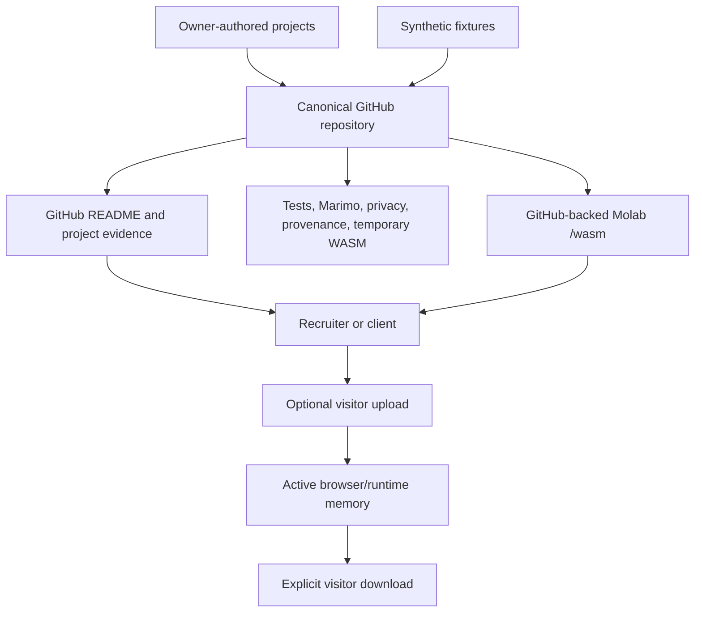

# Public Data Portfolio

## Engineering Profile

| Field | Contract |
|---|---|
| Accountable owner | Tommi Saltiola |
| Canonical source | `Saltiola7/data-portfolio` |
| Working branch | DBSCTR cycle branch reviewed through a pull request |
| Runtime | Python 3.12-3.14 and Marimo 0.23.15 |
| Package authority | `pyproject.toml` and `uv.lock` |
| Public data | Synthetic or explicitly redistributable only |
| Browser delivery | GitHub-backed Molab `/wasm` links |
| Accessibility | WCAG 2.2 AA |
| Validation | pytest, Ruff, strict Marimo check, temporary WASM export, browser review, privacy and provenance audits |
| Security owner | Repository owner |
| Recovery owner | Repository owner through private recovery bundle and local refs |
| Integration boundary | Pull-request review; no direct public `main` mutation |

Applicable DBSCTR modules: Python, Security, Data, ML/AI, Analytics, Web, and
Cloud for deployment preparation.

## Architecture



## Visual Evidence

| Concern | Decision |
|---|---|
| Boundary | required: architecture and trust-boundary flow above |
| Interaction | not applicable: individual project specs own interactive behavior |
| State | not applicable: publication approval is a gate, not a runtime state machine |
| Data/trust | required: architecture and trust-boundary flow above |
| Schema | not applicable: project specs own persistent and tabular schemas |
| Dependency/deployment | required: architecture and trust-boundary flow above |
| Quantitative | not applicable: no portfolio decision depends on a measured comparison |

**Review question:** Can public source reach a visitor only through validated
derived views, while visitor uploads remain outside owner storage?

**Text equivalent:** Owner-authored projects and synthetic fixtures enter the
canonical GitHub repository. CI validates source plus temporary WASM exports.
Visitors inspect the GitHub README and evidence or open a source-pinned Molab
`/wasm` app. A visitor can optionally place a bounded upload in the active
browser runtime and explicitly download derived output; no owner backend
receives or retains it.

Canonical source: this specification. Owner: repository owner. Change trigger:
project admission, validation, delivery, upload, or retention boundaries change.

## Domain

| Term | Meaning |
|---|---|
| flagship | Current, tested project aligned with target contract roles |
| public fixture | Synthetic or redistributable data with recorded lineage |
| evidence packet | Tests, metrics, provenance, limitations, and source identity |
| browser demo | On-demand Molab `/wasm` view using public or runtime-only data |
| clean root | Branch with no parent relationship to old public history |
| legacy | Repaired historical work that passes current gates; empty initially |
| clean-room successor | Independent implementation that generalizes a prior idea without copying restricted artifacts |
| learning lab | Supporting synthetic Marimo demonstration below flagship status |
| certification evidence map | Competency-to-successor trace that excludes assessment material |

Entities:

- `PortfolioProject`, identified by project slug
- `PublicFixture`, identified by path and SHA-256
- `MarimoApp`, identified by source path and commit
- `Deployment`, identified by source commit and public URL
- `ServiceOffer`, identified by product and scope version
- `LearningLab`, identified by project slug and Marimo source path
- `CertificationEvidenceMap`, identified by credential and public successor

## Behavior

### Admit a project

Given a project has owner-authored code, synthetic or cleared data, tests,
provenance, and limitations, when all project gates pass, then it appears as a
flagship with traceable source and evidence.

### Reject contaminated material

Given a candidate contains employer, client, restricted assessment prompt,
assessment data, assessment solution code, unapproved personal material, or
unknown-license material, when admission runs, then publication fails and no
public source or derived runtime includes it.

### Admit approved professional credential evidence

Given the owner approves an issuer certificate for public professional use,
when the image content, metadata, checksum, provenance, and official
verification URL pass review, then the credential evidence may be published
without admitting any associated assessment material.

### Admit a clean-room successor

Given a prior project supplies only conceptual inspiration, when new behavior,
code, fixtures, schemas, tests, metrics, and documentation are independently
implemented and the ancestry is disclosed, then the successor may be admitted.

### Run without private dependencies

Given a visitor opens a demo without credentials or private infrastructure,
when the default path runs, then it produces a useful deterministic result from
public fixtures or runtime-only uploaded data.

### Preserve private uploads

Given a visitor uploads supported data, when browser-local processing runs, then
the data is not committed, logged, snapshotted, or retained by an owner backend.

### Retire the static portfolio site

Given GitHub source is canonical, when repository-only publication is enabled,
then the static `site/` tree, Pages deployment actions, Pages permissions, and
Pages URLs are absent while GitHub evidence and Molab links remain usable.

### Keep learning labs subordinate

Given a clean-room modernization passes every learning-lab gate, when the root
README presents it, then it appears below the three flagships with explicit
synthetic and historical-learning context.

## Contracts

- Every tracked path is intentionally authored or admitted.
- No `node_modules`, private path, secret-like value, PII artifact, client
  identifier, or unknown-license dataset is reachable from clean-root history.
- Raw assessment prompts, datasets, solutions, and outputs are excluded.
  Owner-approved issuer certificate images may be used only after visible
  content, metadata, checksums, provenance, and official verification links are
  reviewed.
- Every fixture has schema, grain, generator or source, license, and SHA-256.
- Every notebook passes strict Marimo validation and fresh-clone execution.
- Every README or project claim maps to code, tests, or an owner-approved fact.
- The repository contains no `site/` tree and CI contains no Pages upload,
  deployment action, environment, or write permission.
- The root README links the canonical GitHub repository and each admitted
  flagship's GitHub-backed Molab `/wasm` runtime.
- User-uploaded data and BYOK credentials are runtime-only.
- Browser demos expose loading, empty, success, validation, and error states.
- Public integration identifies source SHA, rollback ref, compatibility, and
  CI health.

## Portfolio Tiers

Flagships:

1. Synthetic Wellness Data Pipeline
2. Content Performance Classifier
3. Public-sector Opportunity Pipeline

Supporting learning labs:

1. Airline Delay Quality Lab
2. Synthetic Health Risk Quality Lab
3. Restaurant Location Quality Lab
4. Streaming Catalog Explorer
5. Judo Medal Explorer

Independent products and service evidence:

1. Search Taxonomy Lab
2. Content Evidence Workbench
3. DBSCTR Delivery Accelerator

Raw DataCamp certification solutions, assessment schemas, prompts, datasets,
outputs, metrics, and legacy notebook source do not enter public history. The
flagships and learning labs are independently implemented synthetic successors.
The certification evidence map may describe broad competencies and point to
public successors without reproducing assessment material.

## Validation

```bash
uv run --frozen pytest -q
uv run --frozen ruff check scripts tests
uv run --frozen ruff format --check scripts tests
uv run --frozen python scripts/validate_wasm_export.py <export> --package <package>
uv run --frozen python scripts/browser_smoke.py <site> --scenario <journey>
```

Project-local locked environments run focused pytest, Ruff, strict Marimo,
session-source, and temporary executed-WASM gates. Integration also adds
clean-history, privacy, browser interaction, vulnerability, SBOM, and
source-identity checks.

## Gate Ledger

| Gate | Applicability | Required result |
|---|---|---|
| Domain | required | Terms, owners, trust boundaries, and modules fixed |
| Behavior | required | Admission, rejection, runtime, privacy, and retirement scenarios fixed |
| Spec | required | Project layout, interfaces, dependencies, and backlog fixed |
| Contract | required | Privacy, provenance, reproducibility, and release invariants executable |
| Test-driven implementation | required | Red then green project evidence |
| Refactor | required | Coherent source and current documentation |
| Review/Integrate | required | Traceability, compatibility, and affected scope reviewed |
| Release | not applicable | Draft pull request creates no versioned release |
| Deploy | required | Pages stays disabled and public route returns not found |
| Operate | not applicable | No running owner service |
| Maintain/Retire | required | Support, dependency, data, and retirement obligations documented |
