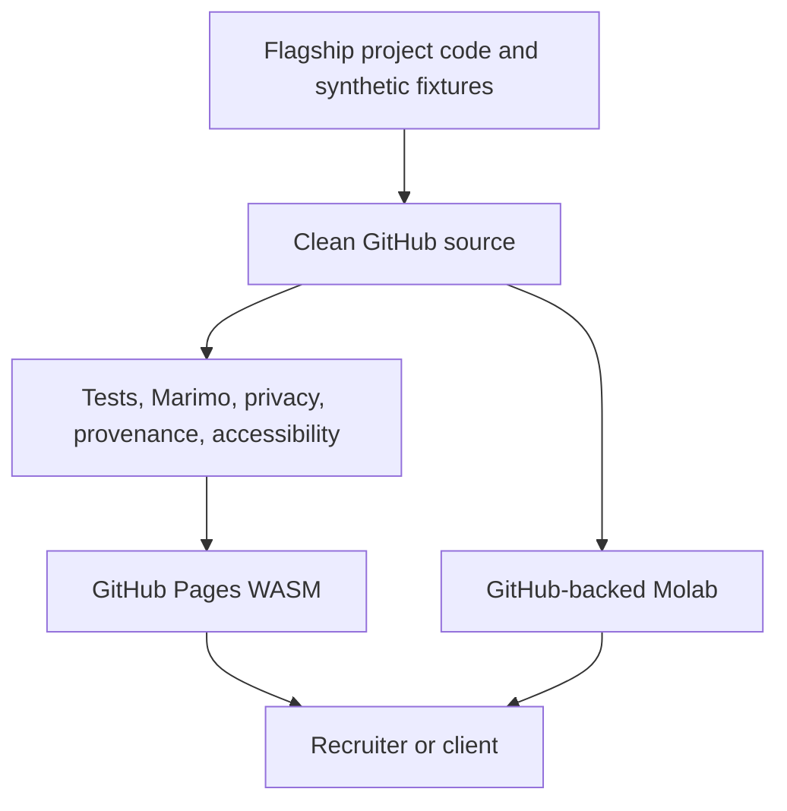

# Public Engineering Portfolio

## Engineering Profile

| Field | Contract |
|---|---|
| Accountable owner | Tommi Saltiola |
| Canonical source | Existing `Data-Analysis-Portfolio` GitHub repository after approved replacement |
| Working branch | Local orphan `codex/clean-root` |
| Runtime | Python 3.12+ and one pinned Marimo version |
| Package authority | `pyproject.toml` and `uv.lock` |
| Public data | Synthetic or explicitly redistributable only |
| Browser delivery | GitHub Pages WASM and GitHub-backed Molab |
| Accessibility | WCAG 2.2 AA |
| Validation | pytest, Ruff, strict Marimo check, export smoke, browser review, privacy and provenance audits |
| Security owner | Repository owner |
| Recovery owner | Repository owner through private recovery bundle and local refs |
| Release boundary | No remote branch replacement without reviewed preview and explicit approval |

Applicable DBSCTR modules: Python, Security, Data, ML/AI, Analytics, Web, and
Cloud for deployment preparation.

## Architecture



## Domain

| Term | Meaning |
|---|---|
| flagship | Current, tested project aligned with target contract roles |
| public fixture | Synthetic or redistributable data with recorded lineage |
| evidence packet | Tests, metrics, provenance, limitations, and source identity |
| browser demo | Derived WASM or Molab view using public or runtime-only data |
| clean root | Branch with no parent relationship to old public history |
| legacy | Repaired historical work that passes current gates; empty initially |

Entities:

- `PortfolioProject`, identified by project slug
- `PublicFixture`, identified by path and SHA-256
- `MarimoApp`, identified by source path and commit
- `Deployment`, identified by source commit and public URL
- `ServiceOffer`, identified by product and scope version

## Behavior

### Admit a project

Given a project has owner-authored code, synthetic or cleared data, tests,
provenance, and limitations, when all project gates pass, then it appears as a
flagship with traceable source and evidence.

### Reject contaminated material

Given a candidate contains employer, client, restricted assessment, personal,
credential, or unknown-license material, when admission runs, then publication
fails and no derived deployment includes it.

### Run without private dependencies

Given a visitor opens a demo without credentials or private infrastructure,
when the default path runs, then it produces a useful deterministic result from
public fixtures or runtime-only uploaded data.

### Preserve private uploads

Given a visitor uploads supported data, when browser-local processing runs, then
the data is not committed, logged, snapshotted, or retained by an owner backend.

### Stop before public replacement

Given local clean-root validation passes, when no final release approval exists,
then the existing remote `main` remains unchanged.

## Contracts

- Every tracked path is intentionally authored or admitted.
- No `node_modules`, private path, secret-like value, PII artifact, client
  identifier, or unknown-license dataset is reachable from clean-root history.
- Every fixture has schema, grain, generator or source, license, and SHA-256.
- Every notebook passes strict Marimo validation and fresh-clone execution.
- Every claim in landing pages maps to code, tests, or an owner-approved
  professional fact.
- User-uploaded data and BYOK credentials are runtime-only.
- Browser demos expose loading, empty, success, validation, and error states.
- Public release identifies source SHA, rollback ref, compatibility, and
  deployment health.

## Initial Flagships

1. Synthetic wellness data pipeline
2. Content performance classifier
3. Public-sector opportunity pipeline
4. Search Taxonomy Lab, linked from its independent repository
5. Content Evidence Workbench, linked from its independent repository
6. DBSCTR Delivery Accelerator, linked from its canonical MIT repository

## Validation

```bash
pytest
ruff check .
ruff format --check .
marimo check --strict <notebook>
```

Release adds clean-history scanning, WASM export, browser smoke, accessibility,
responsive-layout, link, and source-SHA checks.

## Gate Ledger

| Gate | Applicability | Required result |
|---|---|---|
| Domain | required | Terms, owners, trust boundaries, and modules fixed |
| Behavior | required | Admission, rejection, runtime, privacy, and release scenarios fixed |
| Spec | required | Project layout, interfaces, dependencies, and backlog fixed |
| Contract | required | Privacy, provenance, reproducibility, and release invariants executable |
| Test-driven implementation | required | Red then green project evidence |
| Refactor | required | Coherent source and current documentation |
| Review/Integrate | required | Traceability, compatibility, and affected scope reviewed |
| Release | separate cycle | No publication in local build cycle |
| Deploy | separate cycle | No environment change in local build cycle |
| Operate | separate cycle | No running owner service in local build cycle |
| Maintain/Retire | required | Support, dependency, data, and retirement obligations documented |

