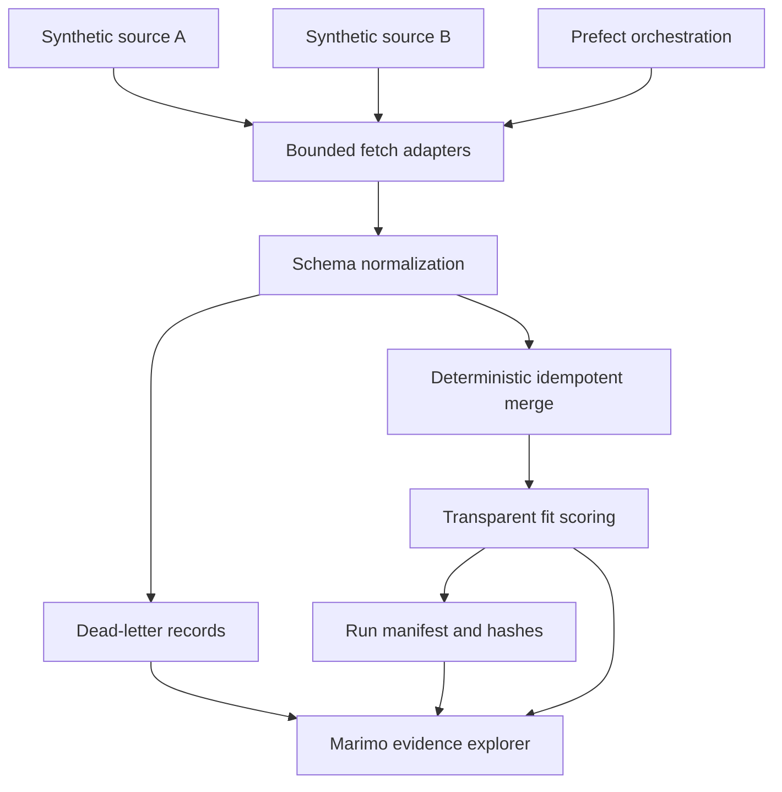

# Public-sector Opportunity Pipeline

## Goal

Demonstrate forward-deployed and platform engineering through a deterministic,
incremental opportunity-ingestion pipeline. The project uses only synthetic
source responses and separates portable domain logic, orchestration, and the
interactive Marimo view.

## Architecture



## Domain

`SourceOpportunity` is one source-specific synthetic record.

`Opportunity` is one canonical solicitation identified by canonical source and
source ID, with title, agency, published and closing dates, location policy,
engagement type, value band, skill tags, and source update timestamp.

`RejectedRecord` stores source, stable source-row identity, reason code, and
controlled detail without copying unrestricted source payloads.

`PipelineState` records the latest accepted source-update timestamp per source.

`RunManifest` records fixture version, seed, input/accepted/rejected counts,
retry counts, state before and after, output grain, and content hashes.

## Behavior

### Normalize heterogeneous sources

Given two valid synthetic source schemas, when the pipeline runs, then records
normalize into one explicit canonical schema and stable ordering.

### Reject invalid records

Given missing identities, invalid dates, inverted closing windows, unsupported
engagement types, or invalid values, when validation runs, then records enter
the dead-letter ledger with stable reason codes.

### Retry transient failures safely

Given a source adapter fails transiently, when orchestration runs, then retries
are bounded, observable, and side-effect free. Permanent failure stops that
source without fabricating data.

### Process incrementally and idempotently

Given prior state and an existing canonical table, when the same source batch
runs again, then output and hashes remain unchanged. Newer records update the
same canonical identity; stale records cannot overwrite them.

### Rank transparently

Given user-selected skill and engagement preferences, when scoring runs, then
each score decomposes into visible rule contributions and never claims
probabilistic suitability.

### Preserve orchestration boundaries

Given the portable core is executed directly or through Prefect, when inputs
and state match, then canonical output, rejection ledger, state, and hashes
match. The Marimo app does not duplicate flow logic.

## Interfaces

```python
def generate_synthetic_sources(seed: int = 2026) -> SourceFixture: ...

def run_pipeline(
    source_batches: Mapping[str, Sequence[Mapping[str, object]]],
    *,
    existing: pandas.DataFrame | None = None,
    state: PipelineState | None = None,
) -> PipelineResult: ...

def score_opportunities(
    opportunities: pandas.DataFrame,
    preferences: FitPreferences,
) -> pandas.DataFrame: ...

def run_prefect_pipeline(
    fixture: SourceFixture,
    *,
    existing: pandas.DataFrame | None = None,
    state: PipelineState | None = None,
) -> PipelineResult: ...
```

## Contracts

- Source payloads are in-memory mappings and total at most 5,000 records.
- Required source and canonical fields fail closed.
- Dates are ISO calendar dates; closing date cannot precede published date.
- Supported engagements are `contract`, `project`, and `consulting`.
- Canonical identity is source plus source ID.
- Duplicate versions choose the greatest source-update timestamp, then a stable
  content hash tie-break; no input-order winner exists.
- Incremental watermarks advance only to accepted source timestamps.
- Existing newer records cannot be replaced by stale source versions.
- Retry count is bounded and recorded; retry delays are injected or disabled in
  tests.
- Fit scoring uses documented additive rules and exposes contributions.
- CSV exports neutralize spreadsheet formula prefixes.
- Prefect is a local orchestration adapter, not a requirement for browser WASM.
- No live procurement endpoint, contact data, employer system, or private
  credential is used in the MVP.

## Validation

- Red tests cover source normalization, schema/date failure, duplicate
  determinism, stale-update protection, idempotency, watermark monotonicity,
  retry exhaustion, core/Prefect parity, scoring decomposition, and safe export.
- Focused pytest and curated Ruff checks pass.
- Strict Marimo check and executable HTML export pass.
- Privacy, provenance, and restricted-material scans pass.
