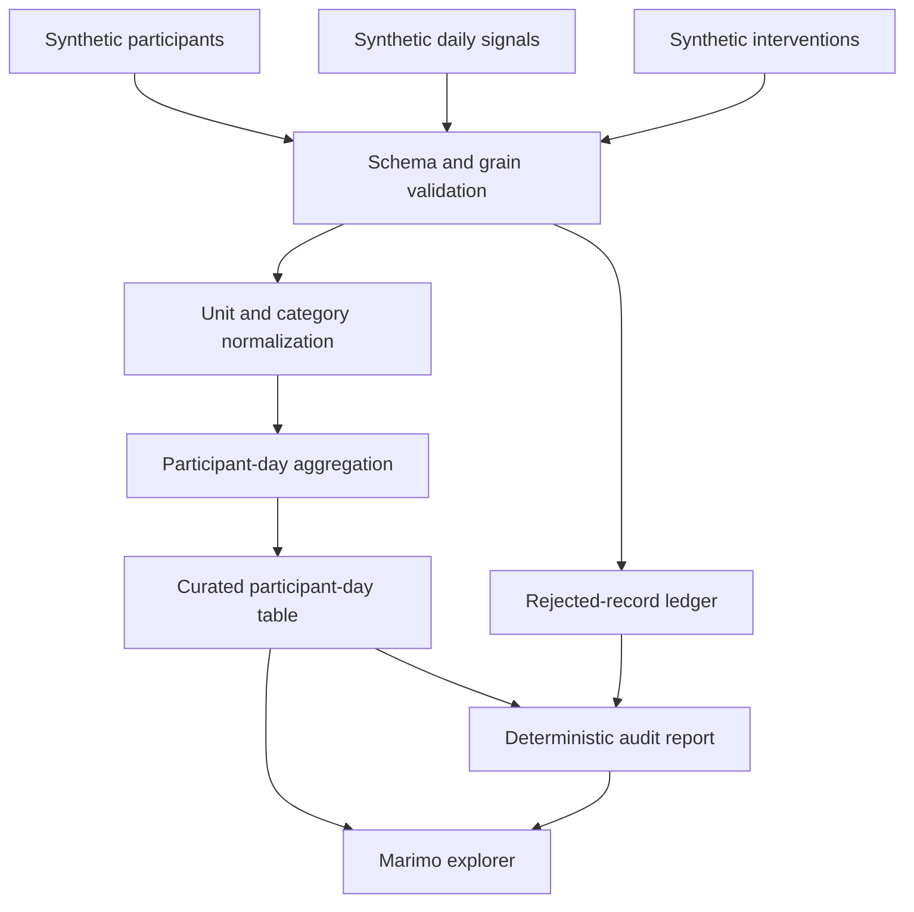

# Synthetic Wellness Data Pipeline

## Goal

Demonstrate production-oriented data engineering through a deterministic,
schema-governed pipeline built entirely from synthetic data. The project is an
independent competency demonstration and contains no certification assessment
materials.

## Architecture



## Domain

### Inputs

| Dataset | Grain | Required fields |
|---|---|---|
| Participant | one row per `participant_id` | `participant_id`, `cohort`, `joined_on` |
| DailySignal | one row per `participant_id` and `observed_on` | `participant_id`, `observed_on`, `sleep_value`, `sleep_unit`, `active_value`, `active_unit`, `pulse_bpm` |
| Intervention | one row per event | `intervention_id`, `participant_id`, `occurred_on`, `intervention`, `dose_value`, `dose_unit` |

### Outputs

`ParticipantDay` grain is one row per `participant_id` and `observed_on`.

Fields:

- participant identity and cohort
- sleep and active duration in minutes
- average pulse
- intervention-event count
- total intervention dose in milligrams
- quality status

`RejectedRecord` grain is one row per rejected input row with source, source-row
identity, reason code, and safe detail.

`AuditReport` records source counts, accepted and rejected counts, output count,
 duplicate counts, missing-participant counts, schema version, and deterministic
content hashes.

## Behavior

### Build a valid participant-day table

Given valid synthetic participants, daily signals, and interventions, when the
pipeline runs, then units normalize, interventions aggregate without changing
participant-day grain, output ordering is deterministic, and the audit report
balances all input rows.

### Normalize supported units

Given duration values in minutes or hours and dose values in micrograms,
milligrams, or grams, when normalization runs, then values convert to minutes
and milligrams without rounding away source precision.

### Reject unsupported units

Given a record uses an unsupported or missing unit, when validation runs, then
the record enters the rejected ledger with a stable reason code and does not
silently enter the curated output.

### Reject unknown participants

Given a signal or intervention references no participant, when the pipeline
runs, then it is rejected and counted in the audit report.

### Preserve idempotency

Given identical inputs and schema version, when the pipeline runs repeatedly,
then curated rows, rejected rows, ordering, and hashes are identical.

### Prevent join multiplication

Given multiple interventions occur for one participant-day, when aggregation
runs, then the curated output retains one participant-day row and reports the
correct event count and total dose.

## Interfaces

```python
def generate_synthetic_fixture(seed: int = 2026) -> SyntheticFixture: ...

def run_pipeline(
    participants: pandas.DataFrame,
    daily_signals: pandas.DataFrame,
    interventions: pandas.DataFrame,
) -> PipelineResult: ...

def normalize_duration(value: object, unit: object) -> float: ...

def normalize_dose_mg(value: object, unit: object) -> float: ...

def audit_to_json(result: PipelineResult) -> str: ...

def read_csv_upload(
    payload: bytes,
    *,
    max_bytes: int = 2_000_000,
    max_rows: int = 10_000,
) -> pandas.DataFrame: ...

def dataframe_to_safe_csv(frame: pandas.DataFrame) -> str: ...
```

`PipelineResult` contains `participant_days`, `rejected_records`, and `audit`.
Functions do not read files, access networks, mutate inputs, or depend on
private configuration.

The Marimo notebook imports these functions, provides bundled-fixture and
bounded upload paths, shows quality evidence, and offers explicit downloads.

## Contracts

- Inputs are copied before transformation.
- Required fields are checked before row processing.
- Each input table is limited to 10,000 data rows.
- Interactive uploads must be nonempty, valid UTF-8 CSV files no larger than
  2 MB and 10,000 data rows.
- Dates use ISO calendar dates and invalid values are rejected.
- Participant IDs and event IDs are nonempty strings.
- Duplicate participants and intervention IDs are rejected deterministically.
- Duplicate daily-signal keys retain no arbitrary winner; every conflicting row
  is rejected.
- Negative duration, dose, or pulse values are rejected.
- Supported duration units: `minute`, `minutes`, `min`, `hour`, `hours`, `h`.
- Supported dose units: `mcg`, `ug`, `mg`, `g`.
- Curated output is sorted by participant and date.
- Rejected details never contain raw credentials or unrestricted payload dumps.
- CSV downloads prefix string cells beginning with spreadsheet formula control
  characters while leaving numeric negative values unchanged.
- Audit hashes use canonical CSV serialization and SHA-256.
- Synthetic generation uses a fixed seed and records generator version.
- No personal or certification-assessment data enters fixtures or snapshots.

## Validation

```bash
pytest -q projects/wellness-data-pipeline/tests
ruff check projects/wellness-data-pipeline
ruff format --check projects/wellness-data-pipeline
marimo check --strict projects/wellness-data-pipeline/app.py
```

Required tests cover schema failure, unit conversion, invalid values, unknown
participants, duplicates, join cardinality, idempotency, audit balance, input
immutability, deterministic fixture generation, and notebook import.
