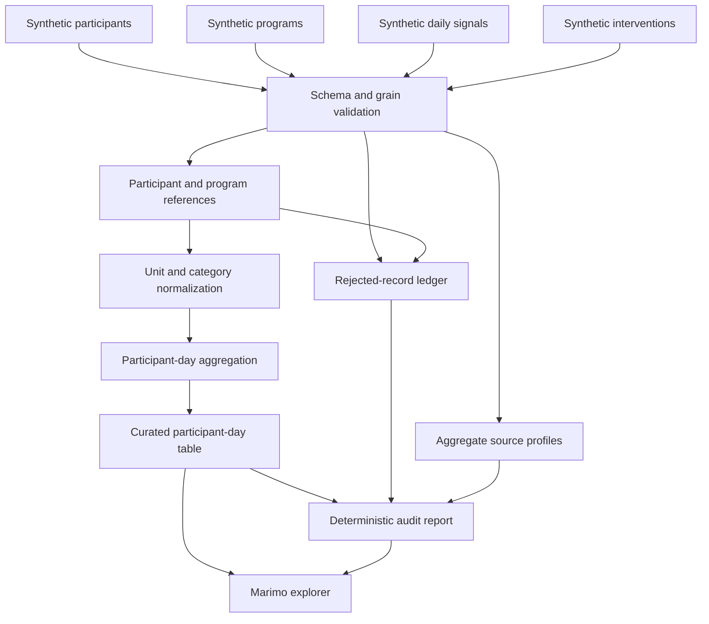

# Synthetic Wellness Data Pipeline

## Goal

Demonstrate production-oriented data engineering through a deterministic,
schema-governed four-source pipeline built entirely from synthetic data. The
project is the public Data Engineer Certification Case Study. It independently
demonstrates assessed competencies without copying any assessment prompt,
supplied data, solution code, exact schema, metric, output, or credential image.

## Architecture



## Visual Evidence

| Concern | Decision |
|---|---|
| Boundary | required: data-flow diagram above |
| Interaction | not applicable: the pipeline is a deterministic synchronous transform |
| State | not applicable: no persistent workflow state machine exists |
| Data/trust | required: data-flow diagram above |
| Schema | required: input and output grain tables below |
| Dependency/deployment | not applicable: browser packaging is owned by the portfolio release spec |
| Quantitative | not applicable: no design decision depends on a measured comparison |

**Review question:** Can each accepted and rejected source row be traced to a
single governed sink without changing participant-day grain?

**Text equivalent:** Fictional participants, programs, daily signals, and
interventions enter schema validation. Valid interventions must resolve both a
participant and program before unit normalization. Interventions aggregate
before joining so the curated table remains one row per participant and day.
Invalid rows enter a controlled rejection ledger. Aggregate source profiles,
curated rows, and rejected rows feed deterministic audit hashes, and the Marimo
explorer reads the curated and audit outputs.

Canonical source: this specification. Owner: repository owner. Change trigger:
source grain, validation, normalization, aggregation, sink, or browser boundary
changes.

## Domain

### Inputs

| Dataset | Grain | Required fields |
|---|---|---|
| Participant | one row per `participant_id` | `participant_id`, `cohort`, `joined_on` |
| Program | one row per `program_id` | `program_id`, `program_name`, `program_type` |
| DailySignal | one row per `participant_id` and `observed_on` | `participant_id`, `observed_on`, `sleep_value`, `sleep_unit`, `active_value`, `active_unit`, `pulse_bpm` |
| Intervention | one row per event | `intervention_id`, `participant_id`, `program_id`, `occurred_on`, `intervention`, `dose_value`, `dose_unit` |

### Outputs

`ParticipantDay` grain is one row per `participant_id` and `observed_on`.

Fields:

- participant identity and cohort
- sleep and active duration in minutes
- average pulse
- intervention-event count
- distinct program count
- total intervention dose in milligrams
- quality status

`RejectedRecord` grain is one row per rejected input row with source, source-row
identity, reason code, and safe detail.

`SourceProfile` records source name, row count, column count, required-field
null counts, duplicate-key count, and accepted/rejected counts without exposing
raw values.

`AuditReport` records source profiles, accepted and rejected counts, output
count, duplicate counts, missing-reference counts, schema version, and
deterministic content hashes.

## Behavior

### Build a valid four-source participant-day table

Given valid synthetic participants, programs, daily signals, and interventions,
when the pipeline runs, then program references resolve, units normalize,
interventions aggregate without changing participant-day grain, output ordering
is deterministic, and the audit report balances all input rows.

### Normalize supported units

Given duration values in minutes or hours and dose values in micrograms,
milligrams, or grams, when normalization runs, then values convert to minutes
and milligrams without rounding away source precision.

### Reject unsupported units

Given a record uses an unsupported or missing unit, when validation runs, then
the record enters the rejected ledger with a stable reason code and does not
silently enter the curated output.

### Reject unknown participants

Given a signal or intervention references no participant, when the pipeline
runs, then it is rejected and counted in the audit report.

### Reject unknown programs

Given an intervention references no program, when the pipeline runs, then the
intervention enters the rejected ledger with an `unknown_program` reason and
does not affect participant-day aggregates.

### Profile sources without disclosing values

Given any admitted source table, when the pipeline runs, then the audit report
records its row count, column count, required-field null counts, duplicate-key
count, and accepted/rejected counts without copying raw values into the profile.

### Preserve idempotency

Given identical inputs and schema version, when the pipeline runs repeatedly,
then curated rows, rejected rows, ordering, and hashes are identical.

### Prevent join multiplication

Given multiple interventions occur for one participant-day, when aggregation
runs, then the curated output retains one participant-day row and reports the
correct event count, distinct program count, and total dose.

## Interfaces

```python
def generate_synthetic_fixture(seed: int = 2026) -> SyntheticFixture: ...

def run_pipeline(
    participants: pandas.DataFrame,
    programs: pandas.DataFrame,
    daily_signals: pandas.DataFrame,
    interventions: pandas.DataFrame,
) -> PipelineResult: ...

def profile_sources(
    participants: pandas.DataFrame,
    programs: pandas.DataFrame,
    daily_signals: pandas.DataFrame,
    interventions: pandas.DataFrame,
) -> dict[str, SourceProfile]: ...

def normalize_duration(value: object, unit: object) -> float: ...

def normalize_dose_mg(value: object, unit: object) -> float: ...

def audit_to_json(result: PipelineResult) -> str: ...

def read_csv_upload(
    payload: bytes,
    *,
    max_bytes: int = 2_000_000,
    max_rows: int = 10_000,
) -> pandas.DataFrame: ...

def dataframe_to_safe_csv(frame: pandas.DataFrame) -> str: ...
```

`SyntheticFixture` contains `participants`, `programs`, `daily_signals`, and
`interventions`. `PipelineResult` contains `participant_days`,
`rejected_records`, and `audit`; the audit embeds aggregate source profiles.
Functions do not read files, access networks, mutate inputs, or depend on
private configuration.

The Marimo notebook imports these functions, provides bundled-fixture and
bounded upload paths, shows quality evidence, and offers explicit downloads.

## Contracts

- Inputs are copied before transformation.
- Required fields are checked before row processing.
- Each input table is limited to 10,000 data rows.
- Interactive uploads must be nonempty, valid UTF-8 CSV files no larger than
  2 MB and 10,000 data rows.
- Dates use ISO calendar dates and invalid values are rejected.
- Participant IDs and event IDs are nonempty strings.
- Program IDs and names are nonempty strings.
- Duplicate participants, programs, and intervention IDs are rejected
  deterministically; conflicting duplicate keys admit no arbitrary winner.
- Duplicate daily-signal keys retain no arbitrary winner; every conflicting row
  is rejected.
- Every admitted intervention resolves one admitted participant and one admitted
  program. Unknown references are rejected before aggregation.
- Negative duration, dose, or pulse values are rejected.
- Supported duration units: `minute`, `minutes`, `min`, `hour`, `hours`, `h`.
- Supported dose units: `mcg`, `ug`, `mg`, `g`.
- Curated output is sorted by participant and date.
- Distinct program counts are computed from admitted intervention program IDs
  after referential validation and before the participant-day join.
- Source profiles contain aggregate counts only. Required-field null counts and
  duplicate-key counts are computed from copied inputs; accepted plus rejected
  counts reconcile to the source-specific processing contract.
- Rejected details never contain raw credentials or unrestricted payload dumps.
- CSV downloads prefix string cells beginning with spreadsheet formula control
  characters while leaving numeric negative values unchanged.
- Audit hashes use canonical CSV serialization and SHA-256.
- Synthetic generation uses a fixed seed and records generator version.
- The default fixture includes at least three programs and at least one
  deterministic invalid program reference so the rejection path remains
  demonstrable.
- Project README and certification evidence expose canonical source,
  specification, and Molab links.
- No personal data or copied certification prompt, supplied dataset, solution,
  output, or credential image enters fixtures or snapshots.

## Validation

```bash
pytest -q projects/wellness-data-pipeline/tests
ruff check projects/wellness-data-pipeline
ruff format --check projects/wellness-data-pipeline
marimo check --strict projects/wellness-data-pipeline/app.py
```

Required tests cover schema failure, unit conversion, invalid values, unknown
participants, duplicates, join cardinality, idempotency, audit balance, input
immutability, deterministic fixture generation, and notebook import.

Current evidence: 36 focused tests plus strict Marimo, executed WASM package,
committed-session source identity, and Chromium interaction gates.
